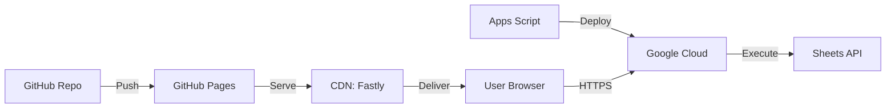
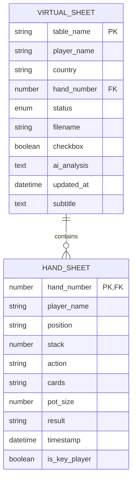
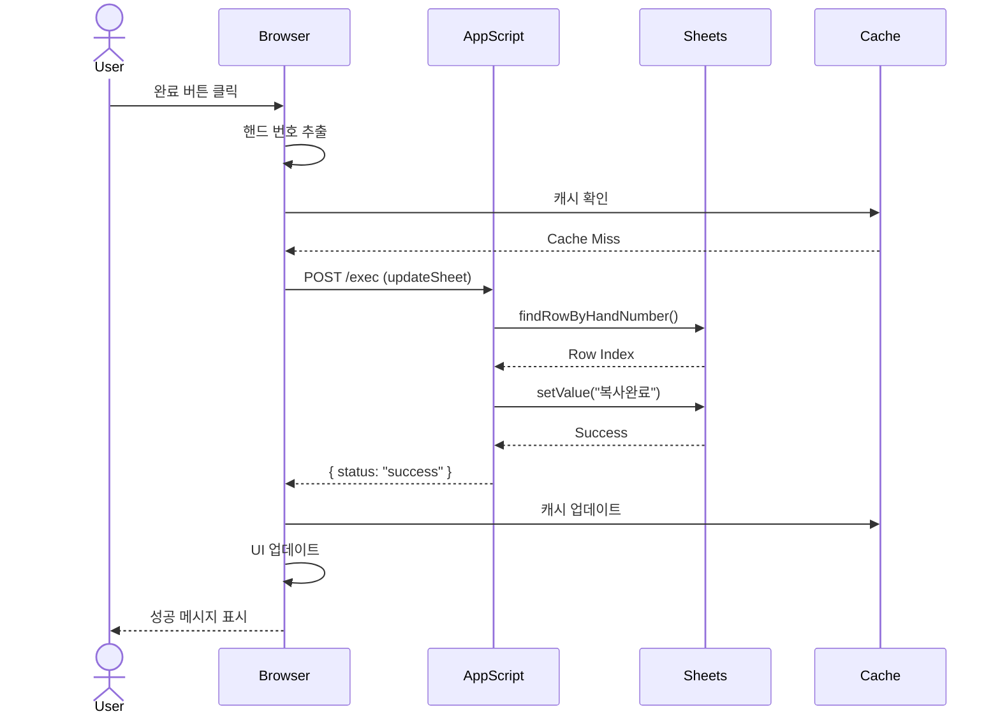

# LLD: Virtual Table DB v13.5.11

**Low-Level Design Document**
**프로젝트**: Virtual Table DB Claude
**현재 버전**: v13.5.11
**문서 버전**: 1.0.0
**작성일**: 2025-10-05

---

## 📋 목차

1. [시스템 아키텍처](#시스템-아키텍처)
2. [데이터 구조](#데이터-구조)
3. [API 설계](#api-설계)
4. [핵심 모듈](#핵심-모듈)
5. [보안 설계](#보안-설계)
6. [성능 최적화](#성능-최적화)

---

## 🏗️ 시스템 아키텍처

### 1.1 전체 아키텍처

```
┌─────────────────────────────────────────────────────┐
│                   Browser (Client)                  │
│  ┌──────────────────────────────────────────────┐  │
│  │         index.html (357KB)                   │  │
│  │  ┌────────────┐  ┌──────────┐  ┌──────────┐ │  │
│  │  │ UI Layer   │  │  State   │  │  Cache   │ │  │
│  │  └────────────┘  └──────────┘  └──────────┘ │  │
│  │  ┌────────────────────────────────────────┐ │  │
│  │  │        Business Logic Layer            │ │  │
│  │  │  - HandManager                         │ │  │
│  │  │  - AIAnalyzer                          │ │  │
│  │  │  - FilenameGenerator                   │ │  │
│  │  │  - SubtitleGenerator                   │ │  │
│  │  └────────────────────────────────────────┘ │  │
│  │  ┌────────────────────────────────────────┐ │  │
│  │  │         Data Access Layer              │ │  │
│  │  │  - SheetsAPI                           │ │  │
│  │  │  - LocalStorage                        │ │  │
│  │  └────────────────────────────────────────┘ │  │
│  └──────────────────────────────────────────────┘  │
└─────────────────────────────────────────────────────┘
                        │
                  ┌─────▼──────┐
                  │   HTTPS    │
                  └─────┬──────┘
                        │
┌─────────────────────────────────────────────────────┐
│            Google Apps Script (Server)              │
│  ┌──────────────────────────────────────────────┐  │
│  │           appScripts.gs (23KB)               │  │
│  │  ┌────────────┐  ┌──────────┐  ┌──────────┐ │  │
│  │  │ doGet/Post │  │ Actions  │  │ CORS     │ │  │
│  │  └────────────┘  └──────────┘  └──────────┘ │  │
│  │  ┌────────────────────────────────────────┐ │  │
│  │  │         Sheet Operations               │ │  │
│  │  │  - updateSheet                         │ │  │
│  │  │  - getSheetData                        │ │  │
│  │  │  - findRowByHandNumber                 │ │  │
│  │  └────────────────────────────────────────┘ │  │
│  └──────────────────────────────────────────────┘  │
└─────────────────────────────────────────────────────┘
                        │
                  ┌─────▼──────┐
                  │   Sheets   │
                  │    API     │
                  └─────┬──────┘
                        │
┌─────────────────────────────────────────────────────┐
│              Google Sheets (Database)               │
│  ┌────────────────┐      ┌─────────────────────┐   │
│  │  Virtual Sheet │      │     Hand Sheet      │   │
│  │  (테이블 정보)   │      │   (핸드 상세)        │   │
│  └────────────────┘      └─────────────────────┘   │
└─────────────────────────────────────────────────────┘

External Services:
┌─────────────┐
│  Gemini API │ ← AI 분석
└─────────────┘
```

### 1.2 기술 스택

```yaml
Frontend:
  - HTML5 (Semantic)
  - CSS3 (Grid, Flexbox)
  - JavaScript ES6+
  - Papa Parse v5.4.1 (CSV 파싱)
  - No Framework (순수 JS)

Backend:
  - Google Apps Script
  - Google Sheets API v4
  - Server-Sent Events (SSE)

External APIs:
  - Gemini AI API (분석)

Infrastructure:
  - GitHub Pages (호스팅)
  - Google Cloud (Apps Script 실행)

Storage:
  - Google Sheets (주 데이터베이스)
  - localStorage (클라이언트 캐시)
  - sessionStorage (임시 데이터)
```

### 1.3 배포 아키텍처



---

## 📊 데이터 구조

### 2.1 Google Sheets 스키마

#### Virtual Sheet (테이블 정보)
```
열 구조:
A: 테이블명 (string)
B: 플레이어명 (string)
C: 국가 (string, 3자리 코드)
D: 핸드 번호 (number)
E: 상태 (enum: "미완료" | "복사완료")
F: 파일명 (string)
G: 체크박스 (boolean) - 중복 제거용
H: AI 분석 (text)
I: 업데이트 시간 (datetime)
J: 자막 정보 (text)

인덱스:
- Primary: 핸드 번호 (D열)
- Secondary: 테이블명 + 핸드 번호 (A+D열)
```

#### Hand Sheet (핸드 상세)
```
열 구조:
A: 핸드 번호 (number, FK to Virtual.D)
B: 플레이어명 (string)
C: 포지션 (string)
D: 스택 (number)
E: 액션 (string)
F: 카드 (string)
G: 팟 사이즈 (number)
H: 결과 (string)
I: 타임스탬프 (datetime)
J: 키 플레이어 (boolean) - 자막 생성 플래그

관계:
- Virtual Sheet와 1:N 관계
- 핸드 번호로 조인
```

### 2.2 클라이언트 상태 관리

```javascript
// Global State Object
window.state = {
  // 핸드 데이터 맵핑
  handToFilenameMapping: {
    '12345': 'T1_12345_Alice_Bob.mp4',
    // ...
  },

  // 플레이어 데이터 (테이블별)
  playerDataByTable: {
    'T1': {
      'Alice': {
        country: 'KOR',
        name: 'ALICE',
        stack: 50000,
        seat: 1
      },
      // ...
    }
  },

  // 핸드 상태 사전 로드
  preloadedHandStatuses: {
    '12345': '미완료',
    '12346': '복사완료',
    // ...
  },

  // 편집 중인 핸드
  editingHandNumber: null,

  // UI 상태
  isLoading: false,
  currentTab: 'hands' // 'hands' | 'settings'
};

// 캐시 관리
window.sheetCache = new SheetDataCache({
  ttl: 5 * 60 * 1000, // 5분
  maxSize: 2000
});
```

### 2.3 localStorage 스키마

```javascript
// API 키 (보안 취약 - 개선 필요)
{
  "GEMINI_API_KEY": "AIza...",
  "lastUpdated": "2025-10-05T10:30:00Z"
}

// 사용자 설정
{
  "settings": {
    "autoRefresh": true,
    "notificationEnabled": true,
    "theme": "dark"
  }
}

// 세션 데이터
{
  "lastVisit": "2025-10-05T10:30:00Z",
  "handHistory": ["12345", "12346", ...]
}
```

---

## 🔌 API 설계

### 3.1 Apps Script API

#### Endpoint
```
POST https://script.google.com/macros/s/{DEPLOYMENT_ID}/exec
```

#### Request Format
```javascript
{
  "action": "updateSheet",
  "sheetUrl": "https://docs.google.com/spreadsheets/d/{SHEET_ID}/...",
  "handNumber": "12345",
  "data": {
    "status": "복사완료",
    "filename": "T1_12345_Alice_Bob.mp4",
    "aiAnalysis": "...",
    "subtitle": "...",
    "timestamp": "2025-10-05T10:30:00Z"
  }
}
```

#### Response Format
```javascript
// Success
{
  "status": "success",
  "message": "데이터가 성공적으로 업데이트되었습니다",
  "updatedRow": 5,
  "data": {
    "handNumber": "12345",
    "status": "복사완료"
  }
}

// Error
{
  "status": "error",
  "message": "핸드 번호를 찾을 수 없습니다",
  "code": "HAND_NOT_FOUND",
  "details": {...}
}
```

#### 지원 액션
```javascript
const ACTIONS = {
  UPDATE_SHEET: 'updateSheet',      // 시트 업데이트
  GET_SHEET_DATA: 'getSheetData',   // 시트 데이터 조회
  CHECK_STATUS: 'checkStatus',      // 상태 확인
  BATCH_UPDATE: 'batchUpdate'       // 일괄 업데이트
};
```

### 3.2 Gemini AI API

#### Request
```javascript
POST https://generativelanguage.googleapis.com/v1/models/gemini-pro:generateContent

Headers:
  Content-Type: application/json
  x-goog-api-key: {API_KEY}

Body:
{
  "contents": [{
    "parts": [{
      "text": "다음 포커 핸드를 분석하세요: ..."
    }]
  }],
  "generationConfig": {
    "temperature": 0.7,
    "topK": 40,
    "topP": 0.95,
    "maxOutputTokens": 1024
  }
}
```

#### Response
```javascript
{
  "candidates": [{
    "content": {
      "parts": [{
        "text": "이 핸드는 프리플랍에서..."
      }]
    },
    "finishReason": "STOP"
  }]
}
```

### 3.3 CSV Data API

#### Virtual Sheet CSV
```
GET https://docs.google.com/spreadsheets/d/{ID}/export?format=csv&gid={GID}

Response (CSV):
테이블,플레이어,국가,핸드번호,상태,파일명,체크박스,AI분석,업데이트시간,자막
T1,Alice,KOR,12345,미완료,T1_12345_Alice_Bob.mp4,TRUE,...,...,...
T1,Bob,USA,12345,미완료,T1_12345_Alice_Bob.mp4,FALSE,...,...,...
```

#### Hand Sheet CSV
```
GET https://docs.google.com/spreadsheets/d/{ID}/export?format=csv&gid={GID}

Response (CSV):
핸드번호,플레이어,포지션,스택,액션,카드,팟,결과,시간,키플레이어
12345,Alice,BTN,50000,Raise,AKs,1000,Win,2025-10-05 10:30,TRUE
12345,Bob,BB,30000,Call,QQ,1000,Lose,2025-10-05 10:30,FALSE
```

---

## 🧩 핵심 모듈

### 4.1 HandManager (핸드 관리)

```javascript
/**
 * 핸드 데이터 관리 및 상태 업데이트
 */
class HandManager {
  constructor(sheetAPI, cache) {
    this.api = sheetAPI;
    this.cache = cache;
  }

  /**
   * 핸드 상태 업데이트
   * @param {string} handNumber - 핸드 번호
   * @param {string} status - 상태 ('미완료' | '복사완료')
   * @returns {Promise<Object>} 업데이트 결과
   */
  async updateStatus(handNumber, status) {
    try {
      // 1. 검증
      if (!this.validateHandNumber(handNumber)) {
        throw new Error('유효하지 않은 핸드 번호');
      }

      // 2. API 호출
      const result = await this.api.updateSheet({
        action: 'updateSheet',
        handNumber,
        data: { status }
      });

      // 3. 캐시 무효화
      this.cache.invalidate(`hand_${handNumber}`);

      // 4. 상태 업데이트
      window.state.preloadedHandStatuses[handNumber] = status;

      return result;
    } catch (error) {
      throw new Error(`핸드 상태 업데이트 실패: ${error.message}`);
    }
  }

  /**
   * 핸드 번호 검증
   */
  validateHandNumber(handNumber) {
    return /^\d{1,10}$/.test(handNumber);
  }
}
```

### 4.2 AIAnalyzer (AI 분석)

```javascript
/**
 * Gemini AI를 활용한 핸드 분석
 */
class AIAnalyzer {
  constructor(apiKey, cache) {
    this.apiKey = apiKey;
    this.cache = cache;
    this.endpoint = 'https://generativelanguage.googleapis.com/v1/models/gemini-pro:generateContent';
  }

  /**
   * 핸드 분석 요청
   * @param {Object} handData - 핸드 데이터
   * @returns {Promise<string>} 분석 결과
   */
  async analyze(handData) {
    // 1. 캐시 확인
    const cacheKey = `ai_${handData.handNumber}`;
    const cached = this.cache.get(cacheKey);

    if (cached) {
      return cached;
    }

    // 2. 프롬프트 생성
    const prompt = this.buildPrompt(handData);

    // 3. API 호출
    const response = await fetch(this.endpoint, {
      method: 'POST',
      headers: {
        'Content-Type': 'application/json',
        'x-goog-api-key': this.apiKey
      },
      body: JSON.stringify({
        contents: [{
          parts: [{ text: prompt }]
        }],
        generationConfig: {
          temperature: 0.7,
          maxOutputTokens: 1024
        }
      })
    });

    if (!response.ok) {
      throw new Error(`AI API 오류: ${response.status}`);
    }

    const result = await response.json();
    const analysis = result.candidates[0].content.parts[0].text;

    // 4. 캐싱
    this.cache.set(cacheKey, analysis);

    return analysis;
  }

  /**
   * 프롬프트 생성
   */
  buildPrompt(handData) {
    return `
다음 포커 핸드를 분석하세요:

테이블: ${handData.table}
핸드 번호: ${handData.handNumber}
플레이어: ${handData.players.map(p => `${p.name} (${p.position})`).join(', ')}

액션 히스토리:
${handData.actions.map(a => `${a.player}: ${a.action}`).join('\n')}

결과: ${handData.result}

분석 포인트:
1. 각 플레이어의 플레이 평가
2. 핵심 결정 포인트 분석
3. 개선 제안

간결하게 3-5문장으로 요약하세요.
    `.trim();
  }
}
```

### 4.3 FilenameGenerator (파일명 생성)

```javascript
/**
 * 플레이어 정보 기반 파일명 자동 생성
 */
class FilenameGenerator {
  /**
   * 파일명 생성
   * @param {string} table - 테이블명
   * @param {string} handNumber - 핸드 번호
   * @param {Array<string>} players - 플레이어 목록
   * @returns {string} 생성된 파일명
   */
  generate(table, handNumber, players) {
    // 1. 플레이어명 정규화
    const normalizedPlayers = players
      .map(p => this.normalizeName(p))
      .filter(Boolean)
      .slice(0, 5); // 최대 5명

    // 2. 파일명 조합
    const filename = [
      this.normalizeTable(table),
      handNumber,
      ...normalizedPlayers
    ].join('_');

    // 3. 확장자 추가
    return `${filename}.mp4`;
  }

  /**
   * 테이블명 정규화
   */
  normalizeTable(table) {
    return table.replace(/[^A-Za-z0-9]/g, '');
  }

  /**
   * 플레이어명 정규화
   */
  normalizeName(name) {
    return name
      .replace(/[^A-Za-z0-9가-힣]/g, '')
      .substring(0, 20);
  }
}
```

### 4.4 SubtitleGenerator (자막 생성)

```javascript
/**
 * 키 플레이어 자막 자동 생성
 */
class SubtitleGenerator {
  /**
   * 자막 생성
   * @param {Object} player - 플레이어 정보
   * @returns {string} 생성된 자막
   */
  generate(player) {
    const { country, name, stack, bb } = player;

    // BB 계산
    const stackInBB = Math.round(stack / bb);

    // 포맷팅
    const formattedStack = this.formatNumber(stack);

    return `
${country}
${name.toUpperCase()}
CURRENT STACK - ${formattedStack} (${stackInBB})

`.trim();
  }

  /**
   * 숫자 포맷팅 (천 단위 콤마)
   */
  formatNumber(num) {
    return num.toString().replace(/\B(?=(\d{3})+(?!\d))/g, ',');
  }
}
```

### 4.5 SheetDataCache (캐싱)

```javascript
/**
 * 시트 데이터 캐싱 관리
 */
class SheetDataCache {
  constructor(options = {}) {
    this.cache = new Map();
    this.ttl = options.ttl || 5 * 60 * 1000; // 5분
    this.maxSize = options.maxSize || 2000;
  }

  /**
   * 캐시 저장
   */
  set(key, value) {
    // 크기 제한 체크
    if (this.cache.size >= this.maxSize) {
      const firstKey = this.cache.keys().next().value;
      this.cache.delete(firstKey);
    }

    this.cache.set(key, {
      value,
      timestamp: Date.now()
    });
  }

  /**
   * 캐시 조회
   */
  get(key) {
    const item = this.cache.get(key);

    if (!item) return null;

    // TTL 체크
    if (Date.now() - item.timestamp > this.ttl) {
      this.cache.delete(key);
      return null;
    }

    return item.value;
  }

  /**
   * 캐시 무효화
   */
  invalidate(key) {
    this.cache.delete(key);
  }

  /**
   * 전체 캐시 초기화
   */
  clear() {
    this.cache.clear();
  }
}
```

---

## 🔐 보안 설계

### 5.1 현재 보안 상태

#### 취약점
```javascript
// ❌ localStorage에 평문 저장
localStorage.setItem('GEMINI_API_KEY', apiKey);

// ❌ XSS 취약점
element.innerHTML = userInput;

// ❌ CORS 헤더 불완전
return ContentService.createTextOutput(JSON.stringify(data));
```

#### 완화 조치 (현재)
```javascript
// ✅ HTTPS 강제
if (location.protocol !== 'https:') {
  location.replace(`https:${location.href.substring(location.protocol.length)}`);
}

// ✅ Apps Script에서 Properties 사용
const API_KEY = PropertiesService.getScriptProperties().getProperty('GEMINI_API_KEY');
```

### 5.2 개선 계획

#### API 키 암호화
```javascript
// CryptoJS 사용 (추가 예정)
class SecureStorage {
  static encrypt(data) {
    const key = this.getDeviceKey();
    return CryptoJS.AES.encrypt(data, key).toString();
  }

  static decrypt(ciphertext) {
    const key = this.getDeviceKey();
    const bytes = CryptoJS.AES.decrypt(ciphertext, key);
    return bytes.toString(CryptoJS.enc.Utf8);
  }

  static getDeviceKey() {
    // 브라우저 핑거프린트 기반
    return window.btoa(navigator.userAgent + navigator.language);
  }
}
```

#### XSS 방어
```javascript
// DOMPurify 도입 (예정)
import DOMPurify from 'dompurify';

function safeSanitize(dirty) {
  return DOMPurify.sanitize(dirty, {
    ALLOWED_TAGS: ['b', 'i', 'strong', 'em'],
    ALLOWED_ATTR: []
  });
}

// 사용
element.innerHTML = safeSanitize(userInput);
```

#### CORS 헤더 강화
```javascript
// Apps Script (개선)
function createCorsResponse(data) {
  return ContentService.createTextOutput(JSON.stringify(data))
    .setMimeType(ContentService.MimeType.JSON)
    .setHeaders({
      'Access-Control-Allow-Origin': 'https://garimto81.github.io',
      'Access-Control-Allow-Methods': 'GET, POST',
      'Access-Control-Allow-Headers': 'Content-Type',
      'Access-Control-Max-Age': '3600'
    });
}

function doOptions(e) {
  return createCorsResponse({ status: 'ok' });
}
```

---

## ⚡ 성능 최적화

### 6.1 현재 성능 지표

```
초기 로딩 시간: ~3초
Time to Interactive: ~5초
메모리 사용량: ~85MB
번들 크기: 357KB (압축 전)
```

### 6.2 최적화 전략

#### 번들 크기 감소
```javascript
// 1. Code Splitting (Vite 도입 시)
const AIAnalyzer = () => import('./modules/ai-analyzer.js');
const SheetManager = () => import('./modules/sheet-manager.js');

// 2. 트리 셰이킹
// package.json
{
  "sideEffects": false,
  "module": "src/main.js"
}

// 3. 불필요한 코드 제거
// - 사용하지 않는 유틸리티 함수
// - 중복된 로직
// - 디버그 코드
```

#### 렌더링 최적화
```javascript
// 1. Virtual Scrolling
class VirtualList {
  constructor(container, items, itemHeight) {
    this.container = container;
    this.items = items;
    this.itemHeight = itemHeight;
    this.visibleStart = 0;
    this.visibleEnd = 0;
  }

  render() {
    const scrollTop = this.container.scrollTop;
    this.visibleStart = Math.floor(scrollTop / this.itemHeight);
    this.visibleEnd = Math.ceil((scrollTop + this.container.clientHeight) / this.itemHeight);

    const visibleItems = this.items.slice(this.visibleStart, this.visibleEnd);

    this.container.innerHTML = visibleItems
      .map((item, index) => this.renderItem(item, this.visibleStart + index))
      .join('');
  }
}

// 2. Debounce/Throttle
function debounce(func, wait) {
  let timeout;
  return function(...args) {
    clearTimeout(timeout);
    timeout = setTimeout(() => func.apply(this, args), wait);
  };
}

const handleSearch = debounce((query) => {
  // 검색 로직
}, 300);
```

#### 캐싱 전략
```javascript
// 1. HTTP 캐싱 (Apps Script)
function doGet(e) {
  const output = /* ... */;

  return output.setHeaders({
    'Cache-Control': 'public, max-age=3600',
    'ETag': generateETag(data)
  });
}

// 2. Service Worker (예정)
self.addEventListener('fetch', (event) => {
  event.respondWith(
    caches.match(event.request).then((response) => {
      return response || fetch(event.request).then((fetchResponse) => {
        return caches.open('v1').then((cache) => {
          cache.put(event.request, fetchResponse.clone());
          return fetchResponse;
        });
      });
    })
  );
});
```

---

## 📚 부록

### A. 데이터베이스 ER 다이어그램



### B. 시퀀스 다이어그램

#### 핸드 상태 업데이트 플로우


### C. 에러 코드

```javascript
const ERROR_CODES = {
  // 클라이언트 에러 (4xx)
  INVALID_HAND_NUMBER: { code: 'E4001', message: '유효하지 않은 핸드 번호' },
  MISSING_API_KEY: { code: 'E4002', message: 'API 키가 설정되지 않음' },
  INVALID_STATUS: { code: 'E4003', message: '유효하지 않은 상태값' },

  // 서버 에러 (5xx)
  SHEET_NOT_FOUND: { code: 'E5001', message: '시트를 찾을 수 없음' },
  HAND_NOT_FOUND: { code: 'E5002', message: '핸드를 찾을 수 없음' },
  UPDATE_FAILED: { code: 'E5003', message: '업데이트 실패' },

  // 외부 API 에러 (6xx)
  AI_API_ERROR: { code: 'E6001', message: 'AI API 오류' },
  SHEETS_API_ERROR: { code: 'E6002', message: 'Sheets API 오류' },

  // 네트워크 에러 (7xx)
  NETWORK_ERROR: { code: 'E7001', message: '네트워크 연결 오류' },
  TIMEOUT_ERROR: { code: 'E7002', message: '요청 시간 초과' }
};
```

### D. 환경 변수

```bash
# .env.example
# Google Apps Script
APPS_SCRIPT_URL=https://script.google.com/macros/s/{DEPLOYMENT_ID}/exec

# Google Sheets
MAIN_SHEET_URL=https://docs.google.com/spreadsheets/d/{SHEET_ID}/...
CSV_VIRTUAL_URL=https://docs.google.com/spreadsheets/d/{SHEET_ID}/export?format=csv&gid={GID1}
CSV_HAND_URL=https://docs.google.com/spreadsheets/d/{SHEET_ID}/export?format=csv&gid={GID2}

# Gemini AI
GEMINI_API_KEY=AIza...

# 캐시 설정
CACHE_TTL=300000
CACHE_MAX_SIZE=2000

# 개발 환경
NODE_ENV=production
DEBUG_MODE=false
```

---

**작성자**: Development Team
**검토자**: Tech Lead
**승인자**: CTO
**다음 업데이트**: v13.6.0 릴리즈 시
