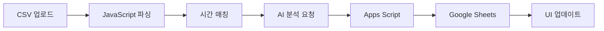

# 📚 Virtual Table DB Claude - 프로젝트 통합 문서

**버전**: v10.1.2 (Frontend) / v3.4.2 (Apps Script)
**최종 업데이트**: 2025-01-16

---

## 📋 목차

1. [프로젝트 개요](#프로젝트-개요)
2. [빠른 시작 가이드](#빠른-시작-가이드)
3. [설치 및 배포](#설치-및-배포)
4. [기술 문서](#기술-문서)
5. [문제 해결 가이드](#문제-해결-가이드)
6. [API 레퍼런스](#api-레퍼런스)
7. [버전 관리 정책](#버전-관리-정책)
8. [체크리스트](#체크리스트)

---

## 🎯 프로젝트 개요

Virtual Table DB는 포커 핸드 데이터를 CSV 파일에서 읽어와 웹 인터페이스를 통해 관리하고, Google Apps Script를 통해 Google Sheets에 자동으로 동기화하는 시스템입니다.

### 주요 기능
- ✅ 실시간 포커 핸드 추적 및 분석
- ✅ Google Sheets 자동 업데이트 (F열: 파일명, H열: AI분석)
- ✅ AI 기반 핸드 분석 (Gemini API)
- ✅ CSV 파일 시간 매칭 (±3분 범위)
- ✅ 웹 기반 모니터링 대시보드
- ✅ 시트 업데이트 디버그 기능

### 기술 스택
- **Frontend**: HTML5, Tailwind CSS, Vanilla JavaScript
- **Backend**: Google Apps Script
- **Database**: Google Sheets
- **AI**: Google Gemini API
- **Hosting**: GitHub Pages

---

## 🚀 빠른 시작 가이드

### 1. Apps Script 배포 (5분)
1. [Google Apps Script](https://script.google.com) 접속
2. 새 프로젝트 생성
3. `scripts/apps_script_v3.4.2.gs` 내용 복사/붙여넣기
4. 배포 > 새 배포 > 웹 앱
5. **액세스 권한: "모든 사용자"** 설정 ⚠️ 중요
6. 배포 URL 복사

### 2. 웹 앱 설정 (2분)
1. https://garimto81.github.io/virtual_table_db_claude/ 접속
2. 설정 버튼 클릭
3. 시트 URL과 Apps Script URL 입력
4. 저장 및 테스트

---

## 📦 설치 및 배포

### Google Apps Script 상세 설정

#### 1단계: 프로젝트 생성
```javascript
// scripts/apps_script_v3.4.2.gs 파일 사용
// ⚠️ 다른 버전은 모두 삭제되었습니다
```

#### 2단계: API 키 설정 (선택사항)
```
프로젝트 설정 > 스크립트 속성
- 속성명: GEMINI_API_KEY
- 값: 실제 Gemini API 키
```

#### 3단계: 배포 설정
```
배포 > 새 배포
- 유형: 웹 앱
- 설명: Virtual Table DB v3.4.2
- 실행 사용자: 나
- 액세스 권한: 모든 사용자 ✅
```

### 웹 애플리케이션 설정

#### GitHub Pages
```bash
# Settings > Pages
Source: Deploy from branch (main)
URL: https://username.github.io/virtual_table_db_claude/
```

#### 로컬 테스트
```bash
# Python 서버
python -m http.server 8000

# Node.js 서버
npx http-server
```

---

## 🔧 기술 문서

### 데이터 흐름



### 시트 구조

| 열 | 내용 | 설명 |
|---|------|------|
| B | 시간 | CSV 시간 매칭용 |
| D | 핸드번호 | 선택사항 |
| E | 파일명 | 자동 업데이트 |
| F | 파일명 | 호환성 (복사) |
| H | AI 분석 | 3줄 요약 |
| I | 업데이트 시간 | 타임스탬프 |

### API 통신

#### 요청 형식
```javascript
{
  action: 'updateSheet',
  sheetUrl: 'Google Sheets URL',
  rowNumber: 5,
  filename: '133_wolfking_Villain09',
  aiAnalysis: 'AI 분석 결과 3줄',
  timestamp: '2025-01-16T10:30:00Z'
}
```

#### 응답 형식
```javascript
{
  status: 'success',
  message: '시트 업데이트 완료',
  data: {
    sheetName: 'Virtual',
    rowNumber: 5,
    updatedFields: ['파일명(F열)', 'AI분석(H열)'],
    updatedAt: '2025-01-16T10:30:00Z'
  }
}
```

---

## 🐛 문제 해결 가이드

### 1. finalAnalysis 오류

#### 증상
```
ReferenceError: finalAnalysis is not defined
```

#### 원인
- Apps Script 캐시 문제
- 이전 버전 코드 실행 중

#### 해결방법

**즉시 해결 (Frontend)**
- index.html이 이미 수정되어 오류를 무시하고 성공 처리

**완전 해결 (Apps Script)**
1. https://script.google.com 접속
2. 배포 > 배포 관리
3. 편집 > 새 버전 선택
4. 설명: "v3.4.2 - finalAnalysis 수정"
5. 업데이트

### 2. CORS 오류

#### 증상
```
Access to fetch at '...' from origin '...' has been blocked by CORS policy
```

#### 해결방법
1. Apps Script 배포 설정 확인
   - 액세스: "모든 사용자" ✅
   - URL: /exec로 끝남 (NOT /dev)

2. 브라우저 캐시 삭제
   - Ctrl+Shift+R (강력 새로고침)

3. Content-Type 확인
   - 자동으로 text/plain 사용 중

### 3. 시트 업데이트 실패

#### 디버그 절차
1. 헤더의 🔍 디버그 버튼 클릭
2. 6단계 검증 수행
3. Apps Script 로그 확인

#### Apps Script 로그 확인
```
script.google.com > 실행 > 실행 기록
```

### 4. 캐시 문제

#### 완전 초기화 스크립트
```javascript
// F12 콘솔에서 실행
localStorage.clear();
location.reload(true);
```

---

## 📚 API 레퍼런스

### Apps Script 엔드포인트

#### GET /exec
서비스 상태 확인
```json
{
  "status": "ok",
  "version": "v3.4.2",
  "gemini_enabled": true
}
```

#### POST /exec

**updateSheet**
```javascript
{
  action: 'updateSheet',
  sheetUrl: string,
  rowNumber: number,
  filename: string,
  aiAnalysis?: string
}
```

**verifyUpdate**
```javascript
{
  action: 'verifyUpdate',
  sheetUrl: string,
  rowNumber: number
}
```

**test**
```javascript
{
  action: 'test'
}
```

---

## 📋 버전 관리 정책

### ⚠️ 중요 규칙

1. **Apps Script는 항상 최신 버전 하나만 유지**
   - 현재: `scripts/apps_script_v3.4.2.gs`
   - 이전 버전은 모두 삭제

2. **버전 업데이트 시**
   - 새 버전 생성
   - 이전 버전 즉시 삭제
   - README 업데이트

3. **파일 구조**
```
scripts/
└── apps_script_v3.4.2.gs  # 최신 버전만 유지
```

### 버전 히스토리

| 버전 | 날짜 | 주요 변경사항 |
|------|------|--------------|
| v3.4.2 | 2025-01-16 | finalAnalysis 오류 완전 수정 |
| v3.4.1 | 2025-01-15 | 오류 처리 개선 |
| v3.4.0 | 2025-01-14 | verifyUpdate 추가 |
| v3.3.0 | 2025-01-13 | E열 검증 규칙 제거 |

---

## ✅ 체크리스트

### 배포 전 확인
- [ ] Apps Script v3.4.2 사용
- [ ] 액세스 권한: "모든 사용자"
- [ ] 시트 편집 권한 부여
- [ ] Apps Script URL이 /exec로 끝남
- [ ] index.html에 URL 설정
- [ ] 테스트 연결 성공

### 정기 점검
- [ ] API 할당량 확인
- [ ] Apps Script 로그 점검
- [ ] 시트 데이터 무결성
- [ ] 성능 지표 모니터링

### 문제 발생 시
1. 🔍 디버그 버튼으로 진단
2. Apps Script 로그 확인
3. 브라우저 콘솔 확인
4. 캐시 삭제 후 재시도

---

## 🚨 긴급 대응

### Apps Script 완전 재배포
```
1. 기존 배포 삭제
2. scripts/apps_script_v3.4.2.gs 복사
3. 새 배포 생성
4. URL 업데이트
```

### 로컬 백업 모드
```javascript
// index.html에 추가
const EMERGENCY_MODE = true;
// 모든 데이터를 LocalStorage에만 저장
```

---

## 📞 지원

- **GitHub**: https://github.com/garimto81/virtual_table_db_claude
- **Issues**: GitHub Issues 활용
- **문서 버전**: v2.0
- **프로젝트 버전**: Frontend v10.1.2 / Backend v3.4.2

---

© 2025 Virtual Table DB Team