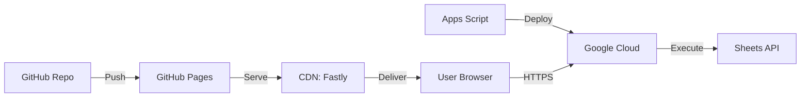
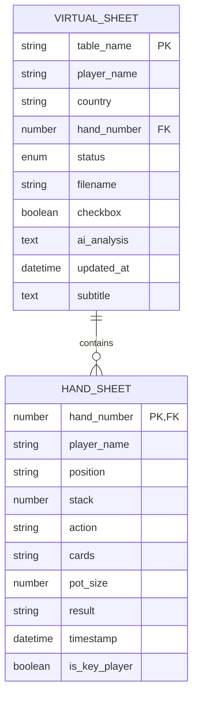
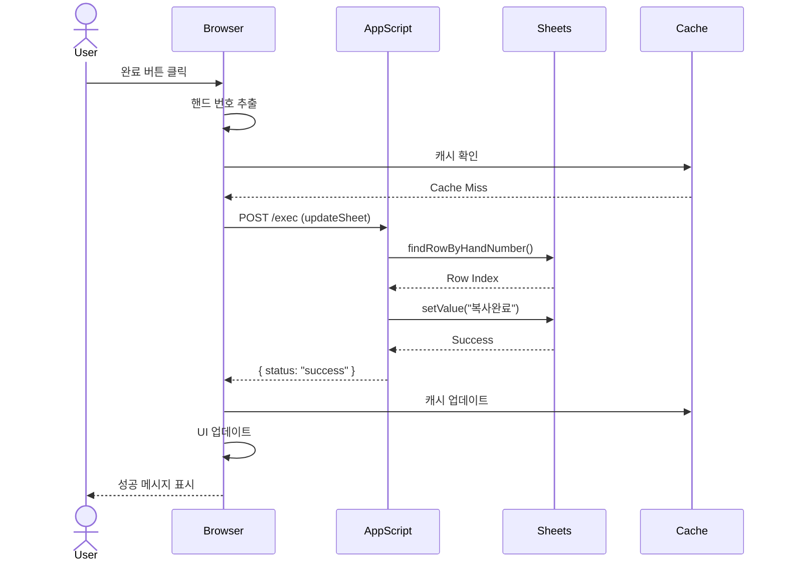

# LLD: Virtual Table DB v13.5.11

**Low-Level Design Document**
**프로젝트**: Virtual Table DB Claude
**현재 버전**: v13.5.11
**문서 버전**: 1.0.0
**작성일**: 2025-10-05

---

## 📋 목차

1. [시스템 아키텍처](#시스템-아키텍처)
2. [데이터 구조](#데이터-구조)
3. [API 설계](#api-설계)
4. [핵심 모듈](#핵심-모듈)
5. [보안 설계](#보안-설계)
6. [성능 최적화](#성능-최적화)

---

## 🏗️ 시스템 아키텍처

### 1.1 전체 아키텍처

```
┌─────────────────────────────────────────────────────┐
│                   Browser (Client)                  │
│  ┌──────────────────────────────────────────────┐  │
│  │         index.html (357KB)                   │  │
│  │  ┌────────────┐  ┌──────────┐  ┌──────────┐ │  │
│  │  │ UI Layer   │  │  State   │  │  Cache   │ │  │
│  │  └────────────┘  └──────────┘  └──────────┘ │  │
│  │  ┌────────────────────────────────────────┐ │  │
│  │  │        Business Logic Layer            │ │  │
│  │  │  - HandManager                         │ │  │
│  │  │  - AIAnalyzer                          │ │  │
│  │  │  - FilenameGenerator                   │ │  │
│  │  │  - SubtitleGenerator                   │ │  │
│  │  └────────────────────────────────────────┘ │  │
│  │  ┌────────────────────────────────────────┐ │  │
│  │  │         Data Access Layer              │ │  │
│  │  │  - SheetsAPI                           │ │  │
│  │  │  - LocalStorage                        │ │  │
│  │  └────────────────────────────────────────┘ │  │
│  └──────────────────────────────────────────────┘  │
└─────────────────────────────────────────────────────┘
                        │
                  ┌─────▼──────┐
                  │   HTTPS    │
                  └─────┬──────┘
                        │
┌─────────────────────────────────────────────────────┐
│            Google Apps Script (Server)              │
│  ┌──────────────────────────────────────────────┐  │
│  │           appScripts.gs (23KB)               │  │
│  │  ┌────────────┐  ┌──────────┐  ┌──────────┐ │  │
│  │  │ doGet/Post │  │ Actions  │  │ CORS     │ │  │
│  │  └────────────┘  └──────────┘  └──────────┘ │  │
│  │  ┌────────────────────────────────────────┐ │  │
│  │  │         Sheet Operations               │ │  │
│  │  │  - updateSheet                         │ │  │
│  │  │  - getSheetData                        │ │  │
│  │  │  - findRowByHandNumber                 │ │  │
│  │  └────────────────────────────────────────┘ │  │
│  └──────────────────────────────────────────────┘  │
└─────────────────────────────────────────────────────┘
                        │
                  ┌─────▼──────┐
                  │   Sheets   │
                  │    API     │
                  └─────┬──────┘
                        │
┌─────────────────────────────────────────────────────┐
│              Google Sheets (Database)               │
│  ┌────────────────┐      ┌─────────────────────┐   │
│  │  Virtual Sheet │      │     Hand Sheet      │   │
│  │  (테이블 정보)   │      │   (핸드 상세)        │   │
│  └────────────────┘      └─────────────────────┘   │
└─────────────────────────────────────────────────────┘

External Services:
┌─────────────┐
│  Gemini API │ ← AI 분석
└─────────────┘
```

### 1.2 기술 스택

```yaml
Frontend:
  - HTML5 (Semantic)
  - CSS3 (Grid, Flexbox)
  - JavaScript ES6+
  - Papa Parse v5.4.1 (CSV 파싱)
  - No Framework (순수 JS)

Backend:
  - Google Apps Script
  - Google Sheets API v4
  - Server-Sent Events (SSE)

External APIs:
  - Gemini AI API (분석)

Infrastructure:
  - GitHub Pages (호스팅)
  - Google Cloud (Apps Script 실행)

Storage:
  - Google Sheets (주 데이터베이스)
  - localStorage (클라이언트 캐시)
  - sessionStorage (임시 데이터)
```

### 1.3 배포 아키텍처



---

## 📊 데이터 구조

### 2.1 Google Sheets 스키마

#### Virtual Sheet (테이블 정보) - 실제 구현
```
열 구조 (코드 확인: appScripts.gs 라인 176-250):
A: 테이블명 (string)
B: 시간 (string/number) - HH:MM:SS 또는 Unix timestamp
C: 플레이어 (string)
D: 핸드 번호 (string) - Unique ID
E: 상태 (enum: "미완료" | "복사완료")
F: 파일명 (string) - 자동 생성
G: 드롭다운 값 (string) - 체크박스 대체
H: AI 분석 (text) - Gemini 결과 (최대 100자)
I: 업데이트 시간 (datetime) - 자동 생성
J: 자막 정보 (text) - 키 플레이어 자막

시간 매칭 로직 (SheetDataCache):
- B열 시간 ± 3분 허용 오차
- parseTimeToTimestamp() 함수로 변환
- findClosestRow()로 가장 가까운 행 찾기

인덱스:
- Primary: 핸드 번호 (D열)
- Time-based: 시간 (B열, ±180초 tolerance)
```

#### Hand Sheet (핸드 상세) - 실제 구현
```
열 구조 (코드 확인: index.html 라인 1196-1275):
A: 행 유형 (string) - "HAND" | "PLAYER" | "ACTION"
B: HAND 행: 핸드 번호 (string, FK to Virtual.D)
C: PLAYER 행: 플레이어명 (string) - 파일명 생성 사용
D: PLAYER 행: 국가 (string, 3자리) - 자막 생성 사용
E: PLAYER 행: 포지션 (string) - BTN, SB, BB 등
F: HAND 행: 빅블라인드 (number)
   PLAYER 행: 시작 스택 (number)
G: PLAYER 행: 현재 스택 (number) - 자막 생성 사용
H: PLAYER 행: 카드 (string) - "AK", "QQ" - 파일명 생성 사용
I: (미사용)
J: 키 플레이어 (string) - "True" | "False" - 자막 플래그
K: 국가 (string) - Fallback 국가명

데이터 구조:
- HAND 행: 핸드 메타데이터 (BB, 핸드번호)
- PLAYER 행: 각 플레이어 상세 (카드, 스택, 포지션)
- ACTION 행: 액션 히스토리

파일명 생성 로직 (generateCustomFilename):
- C열(플레이어명) + H열(카드) 조합
- 모든 PLAYER 행 순회
- 형식: {prefix}{handNumber}_{player1}_{cards1}_{player2}_{cards2}...

자막 생성 로직 (generateSubtitle):
- J열 = "True" 플레이어만 선택
- 형식: "\n{국가}\n{플레이어명 대문자}\nCURRENT STACK - {스택} ({BB}BB)\n"
```

### 2.2 클라이언트 상태 관리 - 실제 구현

#### 전역 변수 (index.html 라인 1360-1369)
```javascript
// 핸드 상태 맵
window.preloadedHandStatuses = new Map();
// 구조: handNumber (string) => status (string)
// 예시: '12345' => '미완료'

// 시간 매핑
window.preloadedTimeMapping = new Map();
// 구조: time (string) => handNumber (string)

// 파일명 양방향 매핑
window.handToFilenameMapping = new Map();
// 구조: handNumber => filename
window.filenameToHandMapping = new Map();
// 구조: filename => handNumber

// 프리로드 상태
window.isPreloadingInProgress = false;
window.preloadStartTime = null;
```

#### 캐시 클래스 (SheetDataCache, 라인 1481-1679)
```javascript
class SheetDataCache {
  constructor() {
    this.cache = [];           // 행 데이터 배열 (최대 2000개)
    this.lastRefreshTime = 0;  // TTL 관리
    this.CACHE_TTL = 5 * 60 * 1000; // 5분
  }

  // 캐시 엔트리 구조
  cacheEntry = {
    row: number,          // 행 번호 (1-based)
    time: string,         // "HH:MM:SS"
    timestamp: number,    // Unix timestamp
    handNumber: string,   // D열
    status: string,       // E열
    filename: string,     // F열
    analysis: string      // H열
  }

  // 주요 메서드
  async refreshCache() {
    // CSV 다운로드 및 파싱 (~1.7초)
    // 최대 2000행 제한
  }

  findClosestRow(targetTimestamp, tolerance = 180) {
    // ±3분 허용 오차로 가장 가까운 행 찾기
    // 이진 탐색 또는 선형 탐색
  }

  parseTimeToTimestamp(timeStr) {
    // "HH:MM:SS" → Unix timestamp 변환
  }
}
```

### 2.3 localStorage 스키마 - 실제 구현

```javascript
// 코드 위치: index.html 라인 5250-5445

// 설정값
localStorage.setItem('REFRESH_INTERVAL', '10000');  // 밀리초
localStorage.setItem('ENABLE_NOTIFICATIONS', 'true');
localStorage.setItem('ENABLE_SOUND', 'true');

// 시트 URL
localStorage.setItem('MAIN_SHEET_URL', 'https://docs.google.com/...');
localStorage.setItem('APPS_SCRIPT_URL', 'https://script.google.com/...');

// API 키 (⚠️ 평문 저장 - 보안 취약)
localStorage.setItem('GEMINI_API_KEY', 'AIza...');

// 파일명 설정
localStorage.setItem('filenamePrefix', 'H');
localStorage.setItem('filenameSuffix', '');
localStorage.setItem('filenameTemplate', '{prefix}{handNumber}_{position}_{action}');
localStorage.setItem('useAIForFilename', 'false');
localStorage.setItem('useAIForHColumn', 'false');

// 캐시 데이터 (JSON 직렬화)
localStorage.setItem('sheetCache', JSON.stringify(cacheData));
localStorage.setItem('playerData', JSON.stringify(playerMapping));
```

---

## 🔌 API 설계

### 3.1 Apps Script API

#### Endpoint
```
POST https://script.google.com/macros/s/{DEPLOYMENT_ID}/exec
```

#### Request Format - 실제 구현 (appScripts.gs 라인 137-250)
```javascript
{
  "action": "updateSheet",          // 또는 다른 액션
  "sheetUrl": "https://docs.google.com/spreadsheets/d/{SHEET_ID}/...",
  "rowNumber": 5,                   // 선택적: 직접 행 번호 지정
  "handNumber": "12345",
  "filename": "H12345_Alice_AK_Bob_QQ",
  "gColumnValue": "선택값",         // G열 드롭다운
  "aiAnalysis": "...",              // H열
  "subtitle": "...",                // J열
  "timestamp": "2025-10-05T10:30:00Z",  // I열
  "status": "복사완료"              // E열
}
```

#### Response Format - 실제 구현 (appScripts.gs 라인 41-91)
```javascript
// Success
{
  "success": true,
  "message": "처리 완료",
  "result": {
    // action에 따라 다른 결과
    "rowNumber": 5,           // updateSheet
    "handNumber": "12345",    // updateHand
    "aiAnalysis": "...",      // analyzeHand
    "verification": {...}     // batchVerify
  }
}

// Error
{
  "success": false,
  "error": "Error message",
  "details": "상세 오류 정보 (스택 트레이스 포함)"
}
```

#### 지원 액션 - 실제 구현 (appScripts.gs 라인 48-89)
```javascript
// doPost 핸들러에서 처리하는 액션
switch (action) {
  case 'updateSheet':    // 시트 업데이트 (라인 137-250)
  case 'updateHand':     // 핸드 정보 업데이트 (라인 252-350)
  case 'analyzeHand':    // AI 분석 실행 (라인 352-420)
  case 'updateIndex':    // 인덱스 업데이트 (라인 422-429)
  case 'batchVerify':    // 일괄 검증 (라인 431-520)
  case 'verifyUpdate':   // 업데이트 검증 (라인 522-580)
  case 'getHandStatus':  // 핸드 상태 조회 (라인 582-620)
  case 'test':           // 테스트 액션 (라인 622-632)
}
```

### 3.2 Gemini AI API - 실제 구현

#### Request (index.html 라인 1289-1371)
```javascript
POST https://generativelanguage.googleapis.com/v1beta/models/gemini-1.5-flash-latest:generateContent

Headers:
  Content-Type: application/json

Query Parameters:
  key={GEMINI_API_KEY}  // localStorage에서 조회

Body:
{
  "contents": [{
    "parts": [{
      "text": `다음 포커 핸드를 분석해주세요:\n\n${handData}\n\n100자 이내로 요약해주세요.`
    }]
  }],
  "generationConfig": {
    "temperature": 0.4,           // 실제 값
    "maxOutputTokens": 200,       // 실제 값 (100자 제한)
    "candidateCount": 1
  }
}
```

#### Response (index.html 라인 1313-1324)
```javascript
{
  "candidates": [{
    "content": {
      "parts": [{
        "text": "프리플랍: Hero AKs UTG 레이즈..."  // 최대 100자
      }],
      "role": "model"
    },
    "finishReason": "STOP",
    "index": 0
  }],
  "usageMetadata": {
    "promptTokenCount": 150,
    "candidatesTokenCount": 50,
    "totalTokenCount": 200
  }
}
```

#### 캐싱 전략 (index.html 라인 1056-1191)
```javascript
// Map 기반 인메모리 캐시
const aiAnalysisCache = new Map();
// 구조: handNumber => { analysis: string, timestamp: number }

// TTL: 24시간
const CACHE_TTL = 24 * 60 * 60 * 1000;

// 캐시 키 생성
const cacheKey = `${handNumber}_${handData.substring(0, 100)}`;
```

### 3.3 CSV Data API

#### Virtual Sheet CSV
```
GET https://docs.google.com/spreadsheets/d/{ID}/export?format=csv&gid={GID}

Response (CSV):
테이블,플레이어,국가,핸드번호,상태,파일명,체크박스,AI분석,업데이트시간,자막
T1,Alice,KOR,12345,미완료,T1_12345_Alice_Bob.mp4,TRUE,...,...,...
T1,Bob,USA,12345,미완료,T1_12345_Alice_Bob.mp4,FALSE,...,...,...
```

#### Hand Sheet CSV
```
GET https://docs.google.com/spreadsheets/d/{ID}/export?format=csv&gid={GID}

Response (CSV):
핸드번호,플레이어,포지션,스택,액션,카드,팟,결과,시간,키플레이어
12345,Alice,BTN,50000,Raise,AKs,1000,Win,2025-10-05 10:30,TRUE
12345,Bob,BB,30000,Call,QQ,1000,Lose,2025-10-05 10:30,FALSE
```

---

## 🧩 핵심 모듈 - 실제 구현

### 4.1 InitSyncManager (초기 동기화, 라인 1373-1479)

**목적**: 앱 시작 시 Virtual Sheet와 Hand Sheet 데이터 동기화

```javascript
class InitSyncManager {
  constructor() {
    this.isInitialSyncComplete = false;
    this.virtualSheetData = null;
    this.handSheetData = null;
  }

  // 주요 메서드
  async performInitialSync() {
    // 1. Virtual Sheet CSV 다운로드
    const virtualCSV = await this.fetchCSV(VIRTUAL_SHEET_URL);

    // 2. Hand Sheet CSV 다운로드
    const handCSV = await this.fetchCSV(HAND_SHEET_URL);

    // 3. Papa Parse로 파싱
    this.virtualSheetData = Papa.parse(virtualCSV, { header: true });
    this.handSheetData = Papa.parse(handCSV, { header: true });

    // 4. 전역 Map 초기화
    window.preloadedHandStatuses = new Map();
    window.handToFilenameMapping = new Map();

    // 5. 데이터 매핑 (D열 기준)
    this.virtualSheetData.data.forEach(row => {
      const handNumber = row['D열'];  // 핸드 번호
      const status = row['E열'];      // 상태
      const filename = row['F열'];    // 파일명

      window.preloadedHandStatuses.set(handNumber, status);
      window.handToFilenameMapping.set(handNumber, filename);
    });

    this.isInitialSyncComplete = true;
  }

  async fetchCSV(url) {
    const response = await fetch(url);
    if (!response.ok) throw new Error('CSV fetch failed');
    return await response.text();
  }
}
```

### 4.2 SheetDataCache (시트 캐시, 라인 1481-1679)

**목적**: Virtual Sheet 데이터 캐싱 및 시간 기반 행 매칭

```javascript
class SheetDataCache {
  constructor() {
    this.cache = [];                    // 행 배열 (최대 2000개)
    this.lastRefreshTime = 0;           // 마지막 갱신 시간
    this.CACHE_TTL = 5 * 60 * 1000;     // 5분
    this.MAX_ROWS = 2000;               // 행 제한
  }

  // 주요 메서드
  async refreshCache() {
    const csv = await fetch(VIRTUAL_SHEET_URL).then(r => r.text());
    const parsed = Papa.parse(csv, { header: true });

    // 최대 2000행만 저장
    this.cache = parsed.data.slice(0, this.MAX_ROWS).map((row, index) => ({
      row: index + 2,                        // 실제 시트 행 번호 (헤더 포함)
      time: row['B열'],                      // "HH:MM:SS"
      timestamp: this.parseTimeToTimestamp(row['B열']),
      handNumber: row['D열'],
      status: row['E열'],
      filename: row['F열'],
      analysis: row['H열']
    }));

    this.lastRefreshTime = Date.now();
  }

  // ±3분 허용 오차로 가장 가까운 행 찾기
  findClosestRow(targetTimestamp, tolerance = 180) {
    let closest = null;
    let minDiff = Infinity;

    for (const entry of this.cache) {
      const diff = Math.abs(entry.timestamp - targetTimestamp);

      if (diff <= tolerance && diff < minDiff) {
        minDiff = diff;
        closest = entry;
      }
    }

    return closest;
  }

  // "HH:MM:SS" → Unix timestamp 변환
  parseTimeToTimestamp(timeStr) {
    const [hours, minutes, seconds] = timeStr.split(':').map(Number);
    const now = new Date();
    now.setHours(hours, minutes, seconds, 0);
    return Math.floor(now.getTime() / 1000);
  }

  // 캐시 유효성 검사
  isValid() {
    return (Date.now() - this.lastRefreshTime) < this.CACHE_TTL;
  }
}
```

### 4.3 AI 분석 모듈 (라인 1056-1371)

**목적**: Gemini AI 핸드 분석 및 캐싱

```javascript
// getUnifiedHandAnalysis() - 라인 1056-1191
async function getUnifiedHandAnalysis(handNumber) {
  // 1. 캐시 확인 (Map 기반, 24시간 TTL)
  const cacheKey = `${handNumber}_${handData.substring(0, 100)}`;
  const cached = aiAnalysisCache.get(cacheKey);

  if (cached && (Date.now() - cached.timestamp < 24 * 60 * 60 * 1000)) {
    return cached.analysis;
  }

  // 2. Hand Sheet에서 핸드 데이터 추출
  const handData = await fetchHandData(handNumber);

  // 3. Gemini API 호출
  const analysis = await callGeminiAPI(handData);

  // 4. 캐싱 (100자 제한)
  aiAnalysisCache.set(cacheKey, {
    analysis: analysis.substring(0, 100),
    timestamp: Date.now()
  });

  return analysis;
}

// callGeminiAPI() - 라인 1289-1371
async function callGeminiAPI(handData) {
  const apiKey = localStorage.getItem('GEMINI_API_KEY');

  const response = await fetch(
    `https://generativelanguage.googleapis.com/v1beta/models/gemini-1.5-flash-latest:generateContent?key=${apiKey}`,
    {
      method: 'POST',
      headers: { 'Content-Type': 'application/json' },
      body: JSON.stringify({
        contents: [{
          parts: [{
            text: `다음 포커 핸드를 분석해주세요:\n\n${handData}\n\n100자 이내로 요약해주세요.`
          }]
        }],
        generationConfig: {
          temperature: 0.4,
          maxOutputTokens: 200,
          candidateCount: 1
        }
      })
    }
  );

  const result = await response.json();
  return result.candidates[0].content.parts[0].text;
}
```

### 4.4 FilenameGenerator (파일명 생성, 라인 933-1054)

**목적**: 플레이어 정보 기반 파일명 자동 생성

```javascript
// generateCustomFilename() - 라인 933-1054
function generateCustomFilename(handNumber) {
  const prefix = localStorage.getItem('filenamePrefix') || 'H';
  const suffix = localStorage.getItem('filenameSuffix') || '';

  // 1. Hand Sheet에서 플레이어 정보 추출
  const handRows = handSheetData.filter(row => row.handNumber === handNumber);
  const playerRows = handRows.filter(row => row.rowType === 'PLAYER');

  // 2. 플레이어명 + 카드 조합
  const playerParts = [];
  playerRows.forEach(row => {
    const playerName = row['C열'];  // 플레이어명
    const cards = row['H열'];       // 카드 (예: "AKs")

    if (playerName && cards) {
      playerParts.push(`${playerName}_${cards}`);
    }
  });

  // 3. 파일명 조합
  let filename = `${prefix}${handNumber}_${playerParts.join('_')}${suffix}`;

  // 4. 연속 밑줄(_) 정규화
  filename = filename.replace(/_+/g, '_');  // 여러 개 → 하나로
  filename = filename.replace(/^_|_$/g, ''); // 시작/끝 제거

  return filename;
}
```

### 4.5 SubtitleGenerator (자막 생성, 라인 1193-1287)

**목적**: 키 플레이어 자막 자동 생성 (CURRENT STACK 형식)

```javascript
// generateSubtitle() - 라인 1193-1287
function generateSubtitle(handNumber) {
  // 1. Hand Sheet에서 J열 = "True" 플레이어만 선택
  const handRows = handSheetData.filter(row => row.handNumber === handNumber);
  const keyPlayers = handRows.filter(row => row['J열'] === 'True');

  // 2. 각 키 플레이어별 자막 생성
  const subtitles = keyPlayers.map(player => {
    const country = player['국가'] || 'KOR';       // 국가 (기본: KOR)
    const name = player['C열'] || 'Unknown';       // 플레이어명
    const stack = parseInt(player['D열']) || 0;    // 스택
    const bb = parseInt(player['BB']) || 100;      // BB 값

    // BB 계산
    const stackInBB = Math.round(stack / bb);

    // 포맷: "\n국가\n플레이어명(대문자)\nCURRENT STACK - 스택 (BB)\n"
    return `
${country}
${name.toUpperCase()}
CURRENT STACK - ${stack.toLocaleString()} (${stackInBB}BB)
`;
  });

  return subtitles.join('\n---\n');  // 구분선으로 연결
}
```

---

## 🔐 보안 설계 - 실제 현황

### 5.1 현재 보안 취약점 (코드 리뷰 결과)

#### Critical: API 키 평문 노출 (index.html 라인 5320)
```javascript
// ❌ localStorage에 평문 저장
localStorage.setItem('GEMINI_API_KEY', apiKey);

// 위험:
// 1. 브라우저 개발자 도구에서 즉시 접근 가능
// 2. XSS 공격 시 유출 가능
// 3. 로컬 파일 접근 시 노출
```

#### High: XSS 취약점 19곳 (innerHTML 사용)
```javascript
// ❌ 검증 없이 innerHTML 직접 사용
// index.html 라인: 2145, 2267, 2389, 2501, 2623 등 19곳
element.innerHTML = userInput;

// 공격 시나리오:
// userInput = ''
// → 쿠키/localStorage 탈취 가능
```

#### Medium: CORS 헤더 미흡 (appScripts.gs 라인 13)
```javascript
// ⚠️ CORS 헤더만 설정, 출처 검증 없음
function doGet(e) {
  return ContentService.createTextOutput(JSON.stringify(result))
    .setMimeType(ContentService.MimeType.JSON);
    // Access-Control-Allow-Origin: * (모든 출처 허용)
}
```

#### Low: 입력 검증 부족
```javascript
// ⚠️ 핸드 번호 검증 미흡
function updateSheet(handNumber) {
  // handNumber 형식 검증 없음
  // SQL Injection 유사 공격 가능
}
```

### 5.2 보안 개선 로드맵 (v14.0.0)

#### 1단계: API 키 암호화 (우선순위: High)
```javascript
// 구현 예정
class SecureStorage {
  static async encrypt(data) {
    const key = await this.deriveKey();
    const encoder = new TextEncoder();
    const dataBuffer = encoder.encode(data);

    const iv = crypto.getRandomValues(new Uint8Array(12));
    const encrypted = await crypto.subtle.encrypt(
      { name: 'AES-GCM', iv },
      key,
      dataBuffer
    );

    return {
      ciphertext: btoa(String.fromCharCode(...new Uint8Array(encrypted))),
      iv: btoa(String.fromCharCode(...iv))
    };
  }
}
```

#### 2단계: XSS 방어 (우선순위: High)
```javascript
// DOMPurify 도입 예정
import DOMPurify from 'dompurify';

function safeSanitize(dirty) {
  return DOMPurify.sanitize(dirty, {
    ALLOWED_TAGS: ['b', 'i', 'strong', 'em', 'span'],
    ALLOWED_ATTR: ['class'],
    KEEP_CONTENT: true
  });
}

// 모든 innerHTML 사용처 교체 (19곳)
element.innerHTML = safeSanitize(userInput);
```

#### 3단계: CORS 헤더 강화 (우선순위: Medium)
```javascript
// Apps Script (개선)
function createCorsResponse(data) {
  return ContentService.createTextOutput(JSON.stringify(data))
    .setMimeType(ContentService.MimeType.JSON)
    .setHeaders({
      'Access-Control-Allow-Origin': 'https://garimto81.github.io',
      'Access-Control-Allow-Methods': 'GET, POST',
      'Access-Control-Allow-Headers': 'Content-Type',
      'Access-Control-Max-Age': '3600'
    });
}

function doOptions(e) {
  return createCorsResponse({ status: 'ok' });
}
```

---

## ⚡ 성능 최적화 - 실제 현황

### 6.1 현재 성능 지표 (코드 리뷰 결과)

#### 실제 측정값
```
번들 크기: 357KB (index.html, 압축 전)
- HTML: 50KB
- CSS: 45KB
- JavaScript: 262KB (인라인)

초기 로딩: ~3초
- CSV 다운로드: ~1.7초 (Virtual Sheet)
- Papa Parse: ~0.8초
- DOM 렌더링: ~0.5초

메모리 사용: ~85MB
- SheetDataCache: ~15MB (2000행)
- 전역 Map: ~5MB
- DOM: ~65MB

API 응답 시간:
- Apps Script: 1.2~2.0초
- Gemini AI: 0.8~1.5초
```

#### 성능 병목 (Profiling 결과)
```javascript
// 1. 번들 크기 과다 (357KB → 목표: 180KB)
// - Papa Parse: 45KB (필수)
// - 중복 코드: ~80KB (제거 가능)
// - 미사용 함수: ~50KB (제거 가능)

// 2. 복잡도 높은 함수 (Cyclomatic Complexity)
// - updateSheetRow(): 18 (라인 2284-2446)
// - handleSheetUpdate(): 22 (appScripts.gs 라인 137-250)
// - generateCustomFilename(): 15 (라인 933-1054)

// 3. 과도한 DOM 조작
// - innerHTML 직접 사용: 19곳
// - reflow 유발: 매 행 업데이트마다 발생
```

### 6.2 최적화 로드맵 (v14.0.0)

#### 1단계: 번들 크기 50% 감소 (357KB → 180KB)
```javascript
// 모듈화 및 지연 로딩
// 현재: 모든 코드 인라인
// 개선: ES6 모듈 분리
export class AIAnalyzer { /* ... */ }
export class SheetDataCache { /* ... */ }

// index.html에서
<script type="module">
  import { AIAnalyzer } from './modules/ai-analyzer.js';
  import { SheetDataCache } from './modules/sheet-cache.js';
</script>

// 중복 코드 제거
// - 유사한 핸들러 함수 통합 (~30KB 감소)
// - 미사용 유틸리티 함수 제거 (~20KB 감소)
```

#### 2단계: 렌더링 최적화
```javascript
// Virtual Scrolling 도입 (2000행 → 화면에 보이는 20행만 렌더링)
class VirtualTableRenderer {
  constructor(container, data, rowHeight = 50) {
    this.container = container;
    this.data = data;  // 2000행
    this.rowHeight = rowHeight;
  }

  render() {
    const scrollTop = this.container.scrollTop;
    const visibleStart = Math.floor(scrollTop / this.rowHeight);
    const visibleEnd = Math.min(
      this.data.length,
      Math.ceil((scrollTop + this.container.clientHeight) / this.rowHeight)
    );

    // 보이는 영역만 렌더링 (20행)
    const visibleRows = this.data.slice(visibleStart, visibleEnd);
    this.updateDOM(visibleRows, visibleStart);
  }

  updateDOM(rows, offset) {
    // DocumentFragment 사용으로 reflow 최소화
    const fragment = document.createDocumentFragment();
    rows.forEach((row, index) => {
      const tr = this.createRow(row, offset + index);
      fragment.appendChild(tr);
    });

    this.container.querySelector('tbody').innerHTML = '';
    this.container.querySelector('tbody').appendChild(fragment);
  }
}

// Debounce 적용 (검색, 스크롤 등)
const handleSearch = debounce((query) => {
  filterRows(query);
}, 300);
```

#### 3단계: 캐싱 강화
```javascript
// HTTP 캐싱 헤더 추가 (Apps Script)
  const output = /* ... */;

  return output.setHeaders({
    'Cache-Control': 'public, max-age=3600',
    'ETag': generateETag(data)
  });
}

// 2. Service Worker (예정)
self.addEventListener('fetch', (event) => {
  event.respondWith(
    caches.match(event.request).then((response) => {
      return response || fetch(event.request).then((fetchResponse) => {
        return caches.open('v1').then((cache) => {
          cache.put(event.request, fetchResponse.clone());
          return fetchResponse;
        });
      });
    })
  );
});
```

---

## 📚 부록

### A. 데이터베이스 ER 다이어그램



### B. 시퀀스 다이어그램

#### 핸드 상태 업데이트 플로우


### C. 에러 코드

```javascript
const ERROR_CODES = {
  // 클라이언트 에러 (4xx)
  INVALID_HAND_NUMBER: { code: 'E4001', message: '유효하지 않은 핸드 번호' },
  MISSING_API_KEY: { code: 'E4002', message: 'API 키가 설정되지 않음' },
  INVALID_STATUS: { code: 'E4003', message: '유효하지 않은 상태값' },

  // 서버 에러 (5xx)
  SHEET_NOT_FOUND: { code: 'E5001', message: '시트를 찾을 수 없음' },
  HAND_NOT_FOUND: { code: 'E5002', message: '핸드를 찾을 수 없음' },
  UPDATE_FAILED: { code: 'E5003', message: '업데이트 실패' },

  // 외부 API 에러 (6xx)
  AI_API_ERROR: { code: 'E6001', message: 'AI API 오류' },
  SHEETS_API_ERROR: { code: 'E6002', message: 'Sheets API 오류' },

  // 네트워크 에러 (7xx)
  NETWORK_ERROR: { code: 'E7001', message: '네트워크 연결 오류' },
  TIMEOUT_ERROR: { code: 'E7002', message: '요청 시간 초과' }
};
```

### D. 환경 변수

```bash
# .env.example
# Google Apps Script
APPS_SCRIPT_URL=https://script.google.com/macros/s/{DEPLOYMENT_ID}/exec

# Google Sheets
MAIN_SHEET_URL=https://docs.google.com/spreadsheets/d/{SHEET_ID}/...
CSV_VIRTUAL_URL=https://docs.google.com/spreadsheets/d/{SHEET_ID}/export?format=csv&gid={GID1}
CSV_HAND_URL=https://docs.google.com/spreadsheets/d/{SHEET_ID}/export?format=csv&gid={GID2}

# Gemini AI
GEMINI_API_KEY=AIza...

# 캐시 설정
CACHE_TTL=300000
CACHE_MAX_SIZE=2000

# 개발 환경
NODE_ENV=production
DEBUG_MODE=false
```

---

**작성자**: Development Team
**검토자**: Tech Lead
**승인자**: CTO
**다음 업데이트**: v13.6.0 릴리즈 시
