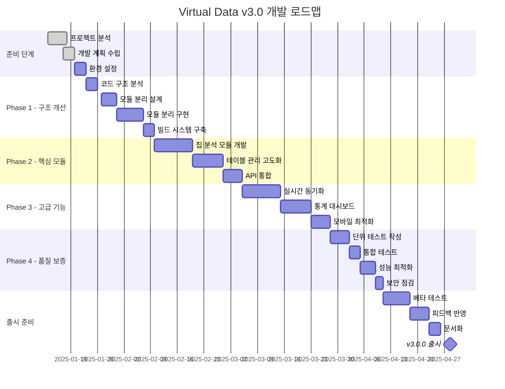

# 🚀 Virtual Data - Poker Hand Logger 개발 로드맵

> 포커 핸드 로깅 시스템의 체계적인 개발 계획 및 기술 가이드

## 📌 프로젝트 현황 분석

### 현재 버전: v2.26.2
**완성도: 85%** ⬛⬛⬛⬛⬛⬛⬛⬛⬛⬜⬜

### ✅ 구현 완료 기능
- ✔️ Google Sheets 실시간 연동 (Apps Script v59)
- ✔️ 플레이어 IN/OUT 상태 관리
- ✔️ 포지션 기반 액션 순서 시스템
- ✔️ 자동 액션 매핑 시스템
- ✔️ 테이블 선택 및 관리 시스템
- ✔️ 칩 카운트 추적 및 자동 계산
- ✔️ 스트릿별 액션 기록
- ✔️ 승자 선택 및 칩 분배
- ✔️ 국가 정보 매핑 시스템

### 🚧 미완성/개선 필요 기능
- ❌ 칩 분석 모듈 (chip-analysis-module.js - 플레이스홀더 상태)
- ❌ 테이블 관리 모듈 (table-management-v59.js - 기본 틀만 존재)
- ⚠️ Gemini Vision API 통합 미완성
- ⚠️ 모놀리식 구조 (index.html 254KB) → 모듈화 필요
- ⚠️ 테스트 코드 부재
- ⚠️ 에러 처리 고도화 필요

---

## 🎯 개발 로드맵

### Phase 1: 코드 구조 개선 (2주)
**목표: 유지보수성 향상 및 모듈화**

#### 1.1 모놀리식 구조 분해
```javascript
// 현재: index.html (254KB)
// 목표: 모듈별 분리

modules/
├── core/
│   ├── app.js              # 메인 애플리케이션
│   ├── config.js           # 설정 관리
│   └── state.js            # 상태 관리
├── features/
│   ├── player-manager.js   # 플레이어 관리
│   ├── hand-logger.js      # 핸드 기록
│   ├── action-mapper.js    # 액션 매핑
│   └── table-selector.js   # 테이블 선택
├── services/
│   ├── sheets-api.js       # Google Sheets API
│   ├── storage.js          # localStorage 관리
│   └── validation.js       # 입력 검증
└── ui/
    ├── modals.js           # 모달 관리
    ├── dashboard.js        # 대시보드
    └── components.js       # UI 컴포넌트
```

#### 1.2 의존성 관리 시스템 구축
```json
// package.json 생성
{
  "name": "virtual-data-poker-logger",
  "version": "3.0.0",
  "type": "module",
  "scripts": {
    "dev": "vite",
    "build": "vite build",
    "test": "vitest",
    "lint": "eslint ."
  },
  "dependencies": {
    "alpinejs": "^3.x",
    "axios": "^1.x"
  },
  "devDependencies": {
    "vite": "^5.x",
    "vitest": "^1.x",
    "eslint": "^8.x"
  }
}
```

### Phase 2: 핵심 모듈 구현 (3주)

#### 2.1 칩 분석 모듈 완성
```javascript
// chip-analysis-module.js
class ChipAnalyzer {
  constructor(apiKey) {
    this.geminiAPI = new GeminiVisionAPI(apiKey);
    this.chipColors = [];
  }

  async analyzeImage(imageData) {
    // 1. 이미지 전처리
    const processed = await this.preprocessImage(imageData);

    // 2. Gemini Vision API 호출
    const analysis = await this.geminiAPI.analyze({
      image: processed,
      prompt: this.buildPrompt()
    });

    // 3. 결과 파싱 및 검증
    return this.parseResults(analysis);
  }

  registerChipColors(colors) {
    // 칩 색상별 가치 등록
    this.chipColors = colors.map(color => ({
      name: color.name,
      value: color.value,
      hex: color.hex,
      tolerance: color.tolerance || 0.1
    }));
  }

  calculateTotal(chipCounts) {
    // 칩 개수를 기반으로 총액 계산
    return chipCounts.reduce((total, count, idx) => {
      return total + (count * this.chipColors[idx].value);
    }, 0);
  }
}
```

#### 2.2 테이블 관리 고도화
```javascript
// table-management-v59.js
class TableManager {
  constructor(sheetsAPI) {
    this.api = sheetsAPI;
    this.tables = new Map();
    this.activeTable = null;
  }

  async loadTables() {
    // 활성 테이블 목록 로드
    const tables = await this.api.getTableList();
    tables.forEach(t => this.tables.set(t.name, t));
    return tables;
  }

  async switchTable(tableName) {
    // 테이블 전환 로직
    if (!this.tables.has(tableName)) {
      throw new Error(`Table ${tableName} not found`);
    }

    // 이전 테이블 정리
    if (this.activeTable) {
      await this.saveTableState();
    }

    // 새 테이블 활성화
    this.activeTable = this.tables.get(tableName);
    await this.loadTableState();

    return this.activeTable;
  }

  async managePlayers(actions) {
    // 플레이어 일괄 관리
    const batch = actions.map(action => ({
      table: this.activeTable.name,
      ...action
    }));

    return await this.api.batchUpdatePlayers(batch);
  }
}
```

### Phase 3: 고급 기능 구현 (4주)

#### 3.1 실시간 동기화 시스템
```javascript
// Real-time Sync with WebSocket or Server-Sent Events
class RealtimeSync {
  constructor(config) {
    this.ws = null;
    this.reconnectAttempts = 0;
    this.syncQueue = [];
  }

  connect() {
    this.ws = new WebSocket(config.wsUrl);

    this.ws.onopen = () => {
      console.log('실시간 동기화 연결');
      this.flushQueue();
    };

    this.ws.onmessage = (event) => {
      this.handleUpdate(JSON.parse(event.data));
    };

    this.ws.onerror = () => {
      this.handleReconnect();
    };
  }

  broadcast(action) {
    if (this.ws.readyState === WebSocket.OPEN) {
      this.ws.send(JSON.stringify(action));
    } else {
      this.syncQueue.push(action);
    }
  }
}
```

#### 3.2 통계 및 분석 대시보드
```javascript
// Statistics Dashboard
class StatsDashboard {
  constructor(dataSource) {
    this.data = dataSource;
    this.charts = {};
  }

  async generateStats(period) {
    const stats = await this.data.getStatistics(period);

    return {
      handsPlayed: stats.totalHands,
      biggestPot: stats.maxPot,
      averagePot: stats.avgPot,
      playerStats: this.calculatePlayerStats(stats.players),
      actionDistribution: this.getActionDistribution(stats.actions),
      profitLoss: this.calculatePnL(stats.chipMovements)
    };
  }

  renderCharts() {
    // Chart.js 또는 D3.js를 사용한 시각화
    this.charts.chipTrend = this.renderChipTrendChart();
    this.charts.actionHeatmap = this.renderActionHeatmap();
    this.charts.winRate = this.renderWinRateChart();
  }
}
```

### Phase 4: 성능 최적화 및 테스트 (2주)

#### 4.1 성능 최적화
```javascript
// Performance Optimizations
const optimizations = {
  // 1. 가상 스크롤링
  virtualScrolling: {
    enable: true,
    itemHeight: 50,
    buffer: 5
  },

  // 2. 디바운싱 및 쓰로틀링
  debouncing: {
    searchDelay: 300,
    saveDelay: 1000
  },

  // 3. 메모이제이션
  memoization: {
    cacheSize: 100,
    ttl: 60000
  },

  // 4. 코드 스플리팅
  codeSplitting: {
    lazy: ['statistics', 'chipAnalysis', 'advancedSettings']
  }
};
```

#### 4.2 테스트 구현
```javascript
// Test Suite
describe('PlayerManager', () => {
  test('플레이어 추가', async () => {
    const manager = new PlayerManager();
    const player = await manager.addPlayer({
      name: 'TestPlayer',
      chips: 1000,
      seat: 1
    });

    expect(player.status).toBe('IN');
    expect(player.chips).toBe(1000);
  });

  test('좌석 충돌 방지', async () => {
    const manager = new PlayerManager();
    await manager.addPlayer({ name: 'Player1', seat: 1 });

    await expect(
      manager.addPlayer({ name: 'Player2', seat: 1 })
    ).rejects.toThrow('Seat already occupied');
  });
});
```

---

## 🛠️ 기술 스택 업그레이드 계획

### 현재 스택
- Vanilla JavaScript
- Tailwind CSS
- Google Apps Script
- localStorage

### 목표 스택
```yaml
Frontend:
  - Framework: Vue 3 / React (선택적)
  - State: Pinia / Redux Toolkit
  - Build: Vite
  - Testing: Vitest + Testing Library
  - Styling: Tailwind CSS + HeadlessUI

Backend:
  - Primary: Google Apps Script (유지)
  - Alternative: Node.js + Express (옵션)
  - Database: Google Sheets + Redis (캐싱)
  - Real-time: WebSocket / Firebase

DevOps:
  - CI/CD: GitHub Actions
  - Hosting: GitHub Pages + Cloudflare
  - Monitoring: Sentry
  - Analytics: Google Analytics 4
```

---

## 📅 개발 스케줄 및 상세 기획

### 🗓️ 2025년 1분기 개발 일정

#### 1월 (준비 및 분석)
| 주차 | 기간 | 작업 내용 | 담당 | 완료율 |
|-----|------|----------|------|--------|
| 3주차 | 1/13-1/19 | 프로젝트 현황 분석 및 계획 수립 | PM | 100% |
| 4주차 | 1/20-1/26 | 코드 구조 분석 및 리팩토링 계획 | 개발팀 | 0% |
| 5주차 | 1/27-2/02 | 모듈 분리 작업 시작 | 개발팀 | 0% |

#### 2월 (핵심 개발)
| 주차 | 기간 | 작업 내용 | 담당 | 완료율 |
|-----|------|----------|------|--------|
| 1주차 | 2/03-2/09 | 칩 분석 모듈 개발 | AI팀 | 0% |
| 2주차 | 2/10-2/16 | 테이블 관리 시스템 고도화 | 백엔드 | 0% |
| 3주차 | 2/17-2/23 | 실시간 동기화 구현 | 풀스택 | 0% |
| 4주차 | 2/24-3/02 | 통계 대시보드 개발 | 프론트 | 0% |

#### 3월 (최적화 및 테스트)
| 주차 | 기간 | 작업 내용 | 담당 | 완료율 |
|-----|------|----------|------|--------|
| 1주차 | 3/03-3/09 | 통합 테스트 | QA팀 | 0% |
| 2주차 | 3/10-3/16 | 성능 최적화 | 개발팀 | 0% |
| 3주차 | 3/17-3/23 | 버그 수정 및 안정화 | 전체 | 0% |
| 4주차 | 3/24-3/30 | 베타 테스트 준비 | PM/QA | 0% |

### 📊 상세 개발 일정표



### 🎯 주차별 상세 기획

#### Week 1-2: 프로젝트 분석 및 계획
**목표**: 현재 코드베이스 완벽 이해 및 개발 전략 수립

**작업 내용**:
- [ ] 전체 코드 리뷰 및 문제점 도출
- [ ] 기술 부채 목록 작성
- [ ] 개발 우선순위 결정
- [ ] 팀 역할 분담

**산출물**:
- 기술 부채 리포트
- 개발 로드맵 문서
- 팀 R&R 문서

#### Week 3-4: 모듈화 작업
**목표**: 254KB 단일 파일을 모듈별로 분리

**작업 내용**:
- [ ] 모듈 경계 정의
- [ ] 의존성 그래프 작성
- [ ] 모듈별 인터페이스 설계
- [ ] 점진적 마이그레이션 시작

**산출물**:
- 모듈 아키텍처 문서
- 마이그레이션 가이드
- 모듈별 API 문서

#### Week 5-6: 칩 분석 모듈
**목표**: Gemini Vision API 통합 완성

**작업 내용**:
- [ ] Gemini API 연동
- [ ] 이미지 전처리 파이프라인
- [ ] 칩 색상 인식 알고리즘
- [ ] 정확도 테스트

**산출물**:
- 칩 분석 모듈 v1.0
- API 연동 가이드
- 테스트 리포트

#### Week 7-8: 실시간 기능
**목표**: 다중 사용자 실시간 협업 지원

**작업 내용**:
- [ ] WebSocket 서버 구축
- [ ] 상태 동기화 로직
- [ ] 충돌 해결 메커니즘
- [ ] 연결 복구 로직

**산출물**:
- 실시간 동기화 시스템
- 스케일링 전략 문서
- 성능 벤치마크

### 📋 스프린트 계획

#### Sprint 1 (1/20 - 2/02)
**스프린트 목표**: 기반 구축

| 티켓 ID | 작업 내용 | 스토리 포인트 | 담당자 | 상태 |
|---------|----------|--------------|--------|------|
| VD-001 | Vite 빌드 시스템 설정 | 3 | - | Todo |
| VD-002 | ESLint/Prettier 설정 | 2 | - | Todo |
| VD-003 | 모듈 구조 설계 | 5 | - | Todo |
| VD-004 | 기본 컴포넌트 분리 | 8 | - | Todo |
| VD-005 | 테스트 환경 구축 | 3 | - | Todo |

#### Sprint 2 (2/03 - 2/16)
**스프린트 목표**: 핵심 모듈 개발

| 티켓 ID | 작업 내용 | 스토리 포인트 | 담당자 | 상태 |
|---------|----------|--------------|--------|------|
| VD-006 | Gemini API 클라이언트 | 5 | - | Todo |
| VD-007 | 칩 이미지 분석 로직 | 8 | - | Todo |
| VD-008 | 테이블 상태 관리 | 5 | - | Todo |
| VD-009 | 플레이어 매니저 리팩토링 | 5 | - | Todo |
| VD-010 | API 에러 처리 | 3 | - | Todo |

### 🎨 기능별 상세 기획

#### 1. 칩 분석 시스템
```
목표: 95% 이상의 정확도로 칩 스택 자동 계산

기능 요구사항:
- 실시간 카메라 캡처
- 다양한 조명 조건 대응
- 5가지 칩 색상 동시 인식
- 스택 높이 기반 개수 추정
- 수동 보정 인터페이스

기술 구현:
- Gemini Vision API
- Canvas 이미지 전처리
- TensorFlow.js (옵션)
- WebRTC 카메라 접근
```

#### 2. 실시간 협업 시스템
```
목표: 10명 동시 접속 지원, 100ms 이내 동기화

기능 요구사항:
- 실시간 커서 공유
- 동시 편집 잠금
- 자동 충돌 해결
- 오프라인 모드 지원
- 변경사항 히스토리

기술 구현:
- WebSocket (Socket.io)
- CRDT 알고리즘
- IndexedDB 로컬 캐싱
- 낙관적 업데이트
```

#### 3. 통계 대시보드
```
목표: 실시간 게임 분석 및 인사이트 제공

기능 요구사항:
- 실시간 차트 업데이트
- 플레이어별 통계
- 시간대별 분석
- 수익/손실 추적
- 패턴 인식

기술 구현:
- Chart.js / D3.js
- Web Workers (계산)
- BigQuery 연동 (옵션)
- 서버리스 함수
```

### 📊 리소스 할당 계획

#### 팀 구성 (권장)
| 역할 | 인원 | 주요 책임 | 필요 스킬 |
|-----|-----|----------|----------|
| PM | 1명 | 프로젝트 관리, 일정 조율 | 애자일, 기획 |
| 풀스택 개발 | 2명 | 전체 시스템 개발 | JS, Node, GAS |
| 프론트엔드 | 1명 | UI/UX 구현 | Vue/React, CSS |
| AI 엔지니어 | 1명 | 칩 분석 모듈 | ML, Vision API |
| QA | 1명 | 테스트 및 품질 보증 | 자동화 테스트 |

#### 예산 계획
| 항목 | 월간 비용 | 연간 비용 | 비고 |
|-----|----------|----------|------|
| Gemini API | $100 | $1,200 | 월 10만 요청 |
| GitHub Pro | $4 | $48 | 프라이빗 저장소 |
| Cloudflare | $20 | $240 | CDN 및 보안 |
| Google Workspace | $12 | $144 | Sheets API |
| Sentry | $26 | $312 | 에러 모니터링 |
| **총계** | **$162** | **$1,944** | |

### 🚦 마일스톤 및 체크포인트

#### Milestone 1: MVP (2025-02-28)
- ✅ 모듈화 완료
- ✅ 기본 칩 분석 기능
- ✅ 테이블 관리 개선

#### Milestone 2: Beta (2025-03-31)
- ✅ 실시간 동기화
- ✅ 통계 대시보드
- ✅ 성능 최적화

#### Milestone 3: v3.0.0 (2025-04-28)
- ✅ 모든 기능 완성
- ✅ 문서화 완료
- ✅ 프로덕션 배포

### 📈 위험 관리

#### 식별된 위험 요소
| 위험 | 가능성 | 영향도 | 대응 방안 |
|-----|--------|-------|----------|
| API 한도 초과 | 중 | 고 | 캐싱 강화, 요청 최적화 |
| 모듈화 복잡도 | 고 | 중 | 점진적 마이그레이션 |
| 실시간 동기화 지연 | 중 | 고 | 서버 스케일링 준비 |
| 브라우저 호환성 | 낮 | 중 | 폴리필 적용 |
| 보안 취약점 | 중 | 고 | 정기 보안 감사 |

---

---

## 🔧 개발 환경 설정

### 필수 도구
```bash
# Node.js 18+ 설치
node --version  # v18.0.0 이상

# pnpm 설치 (권장)
npm install -g pnpm

# 프로젝트 초기화
pnpm install
pnpm run dev
```

### VS Code 확장 프로그램
- ESLint
- Prettier
- Tailwind CSS IntelliSense
- Vue Language Features (Vue 선택 시)
- GitHub Copilot (선택사항)

### 개발 서버 설정
```javascript
// vite.config.js
export default {
  server: {
    port: 3000,
    proxy: {
      '/api': {
        target: 'YOUR_APPS_SCRIPT_URL',
        changeOrigin: true,
        rewrite: (path) => path.replace(/^\/api/, '')
      }
    }
  }
}
```

---

## 📝 코딩 컨벤션

### 명명 규칙
```javascript
// 변수: camelCase
const playerName = 'John';

// 상수: UPPER_SNAKE_CASE
const MAX_PLAYERS = 10;

// 클래스: PascalCase
class PlayerManager {}

// 함수: camelCase + 동사
function calculatePot() {}

// 이벤트 핸들러: handle + 이벤트
function handlePlayerClick() {}

// 불린: is/has/can 접두사
const isActive = true;
const hasChips = false;
const canBet = true;
```

### 폴더 구조
```
src/
├── assets/          # 정적 파일
├── components/      # UI 컴포넌트
├── composables/     # Vue Composition API (Vue 사용 시)
├── hooks/          # React Hooks (React 사용 시)
├── services/       # API 및 외부 서비스
├── stores/         # 상태 관리
├── utils/          # 유틸리티 함수
└── views/          # 페이지 컴포넌트
```

---

## 🚀 배포 전략

### 단계별 배포
1. **개발 환경**: localhost:3000
2. **스테이징**: staging.virtual-data.com
3. **프로덕션**: virtual-data.com

### GitHub Actions CI/CD
```yaml
name: Deploy

on:
  push:
    branches: [main]

jobs:
  deploy:
    runs-on: ubuntu-latest
    steps:
      - uses: actions/checkout@v3
      - uses: actions/setup-node@v3
      - run: pnpm install
      - run: pnpm test
      - run: pnpm build
      - uses: peaceiris/actions-gh-pages@v3
        with:
          github_token: ${{ secrets.GITHUB_TOKEN }}
          publish_dir: ./dist
```

---

## 📈 성공 지표 (KPI)

### 기술적 지표
- ⚡ 페이지 로드 시간 < 2초
- 📊 Lighthouse 점수 > 90
- 🔧 코드 커버리지 > 80%
- 🐛 버그 발생률 < 1%

### 비즈니스 지표
- 👥 일일 활성 사용자 (DAU)
- 📝 일일 기록 핸드 수
- ⏱️ 평균 세션 시간
- 🔄 사용자 재방문율

---

## 🤝 기여 가이드

### 브랜치 전략
```
main (protected)
├── develop
│   ├── feature/chip-analysis
│   ├── feature/realtime-sync
│   └── feature/statistics
├── hotfix/critical-bug
└── release/v3.0.0
```

### 커밋 메시지
```
feat: 칩 분석 모듈 추가
fix: 플레이어 좌석 충돌 버그 수정
docs: 개발 가이드 업데이트
style: 코드 포맷팅
refactor: 테이블 관리 로직 개선
test: 플레이어 매니저 테스트 추가
chore: 의존성 업데이트
```

---

## 📚 참고 자료

### 공식 문서
- [Google Apps Script](https://developers.google.com/apps-script)
- [Gemini API](https://ai.google.dev/)
- [Tailwind CSS](https://tailwindcss.com/)
- [Vite](https://vitejs.dev/)

### 학습 자료
- [Clean Code JavaScript](https://github.com/ryanmcdermott/clean-code-javascript)
- [JavaScript Design Patterns](https://www.patterns.dev/)
- [Web Performance Best Practices](https://web.dev/performance/)

---

**마지막 업데이트**: 2025-01-17
**작성자**: Claude AI Assistant
**버전**: 1.0.0